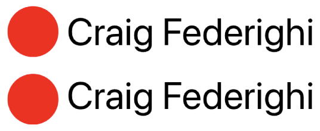

+++
title = 'Correctly aligning UILabels on iOS'
date = 2023-10-11T20:31:15+13:00
draft = false
+++

> This post focuses on center aligning UILabels by setting their frame and may not be useful for other options such as constraint-based layouts

In mobile apps, we commonly implement user interfaces where text needs to be center-aligned to another view, such as an image, label or shape. You may have used a naive solution similar to the code below, but something feels off. Let's investigate this problem and see how it can be fixed.

```
// 1. Align the top of the label to the top of the image
// 2. Center align the label to the image using the frames height
labelView.origin.y = imageView.frame.minY + (imageView.frame.height - labelView.frame.height) / 2
```

## The problem


If we inspect a UILabel using the View Hierarchy Debugger, we can see that the label's bounding box's height extends well past the height of the text itself. This is because the bounding box's height is determined by the font's character with the greatest **ascender** and **descender** values, regardless of whether that character is used.

We can demonstrate this by drawing lines whose origin is determined by the font's ascender (red) and descender (green) values.


But, what is an **ascender** and **descender**? Let's take a look at a font's anatomy next.

## Anatomy of a font


*Original image sourced from [here](https://m2.material.io/design/typography/understanding-typography.html#type-properties)*

The image above shows the different components that make up a typical typeface. The components circled in green are ones that we can access as properties on a UIFont.

> On a UILabel, the font can be accessed with the `font` property.

Apple's documentation (with some adjustments) defines these values as:

`ascender` - The top y-coordinate, offset from the baseline, of the font’s longest ascender. Note that on a UIFont, the ascender is the distance from the baseline, not the median.

`descender` - The bottom y-coordinate, offset from the baseline, of the font’s longest descender. Note that the descender is a **negative** value since it is offset **below** the baseline.

`capHeight` - The height of the tallest capital character.

`xHeight` - The height of the tallest lowercase character.

`lineHeight` - The distance, in points, between the baseline of two lines of text.

Although it's not accessible as a default property, `baseline` is also an important component of a font and can be thought of as the invisible line that characters sit on. It is the reference point for both the ascender and descender.

## The solution

With our newfound knowledge of fonts and UIFont, we can come up with a better way to align text with views.

Instead of centering with the label's default size that we get from `sizeThatFits`, which is determined by characters that may or may not be used, let's go for something more consistent. If you take a look at the majority of text used in user interfaces, you will notice that the height of lowercase characters is relatively uniform. The text you're reading now is an example of this. Further, lowercase characters typically make up the majority of characters used in text. Therefore, we will use the font's `xHeight`.

> If your label uses mostly capital characters, you can substitute `font.xHeight` with `font.capHeight`

```
extension CGRect {
	public mutating func centerAlignY(
		with rect: CGRect, 
		left: CGFloat, 
		font: UIFont, 
		precomputedSize: CGSize = .zero) {
	
	    var y: CGFloat = .zero
	
	    // 1. Align the top of the fonts xHeight with the top of the view
	    y -= font.lineHeight + font.descender - font.xHeight
	    // 2. Center align with view using xHeight
	    y += (rect.height - font.xHeight) / 2
	
	    self = CGRect(
			origin: CGPoint(x: left, y: y),
			size: precomputedSize)
	}
}
```

1 - With the naive solution, we began by aligning the top of the label's `CGRect` to the top of the view. We need to do this with the `xHeight` as well. The following snippet calculates an offset that we can use to align the top of lowercase letters with the top of the view.

`font.lineHeight + font.descender - font.xHeight`


2 - Next, we can perform the center align function from the naive implementation. But this time, we will use the font's `xHeight` rather than the label's height.


We can then use this function like so...

```
labelView.frame.centerAlignY(
	with: circleView.frame,
	left: left,
	font: labelView.font,
	precomputedSize: labelSize)
```

And that's it! A simple 2-step function that correctly aligns a label's `xHeight` to another view. It's a subtle difference for sure, but potentially worth the addition of a simple function.

Finally, a quick comparison between the two solutions. The top is the naive solution and the bottom uses the font's xHeight for alignment.



You can access the repository for the demo project [here](https://github.com/Jessenw/center-align-label)